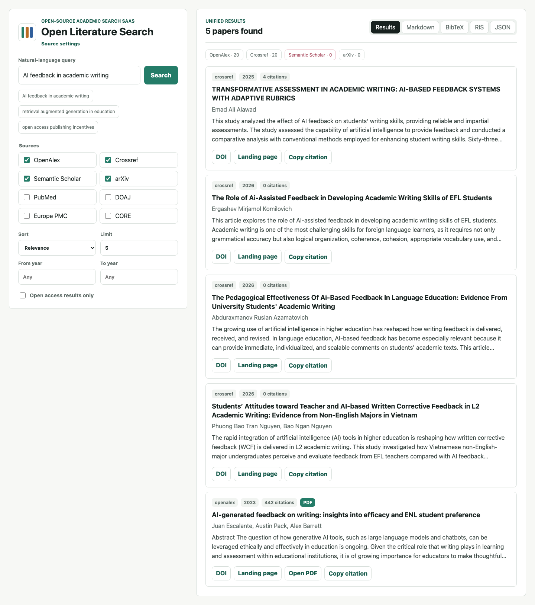

# Open Literature Search

[](https://github.com/Magiciangel/open-literature-search/actions/workflows/ci.yml)
[](https://github.com/Magiciangel/open-literature-search/releases)
[](./LICENSE)

Open Literature Search is an open-source SaaS for natural-language academic literature search across open scholarly sources.

It lets users search OpenAlex, Crossref, Semantic Scholar, arXiv, PubMed, DOAJ, Europe PMC, and CORE from one web interface. Results are normalized into one structure, merged by DOI/title, ranked by relevance, and enriched with open-access signals from Unpaywall when DOI data is available.

## Open-source Software

This repository is open-source software released under the MIT License.

Original author: **Zeke**

Anyone may use, copy, modify, merge, publish, distribute, sublicense, or sell copies of this software, as long as the original copyright notice and MIT License text are preserved.

## Current Release

Latest release: [v0.3.0 - Academic Export Release](https://github.com/Magiciangel/open-literature-search/releases/tag/v0.3.0)

v0.3.0 focuses on making search results easier to reuse in academic workflows:

- BibTeX export
- RIS export
- Plain citation copy for individual papers
- Shared export formatter utilities
- Export formatter tests

v0.2.0 focuses on making the project easier to deploy, verify, and contribute to:

- GitHub Actions CI for tests, typecheck, and production build
- Dockerfile and Docker Compose support
- Vercel deployment instructions and deploy button
- README screenshots
- Source settings page
- Configurable source registry
- Issue templates and pull request template
- CONTRIBUTING.md and SECURITY.md
- Local `npm run ci` command



## Quick Start

```bash
npm install
npm run dev
```

Open:

```txt
http://localhost:3000
```

## What It Does

- Natural-language academic literature search
- Multi-source search across open scholarly indexes
- OpenAlex, Crossref, Semantic Scholar, arXiv, PubMed, DOAJ, Europe PMC, and CORE support
- Optional Unpaywall enrichment for open full-text links
- Unified result structure
- DOI normalization
- DOI/title deduplication
- Relevance, year, citation count, and open-access-first sorting
- JSON and Markdown result views
- BibTeX and RIS export views
- One-click citation copy per result
- MIT-licensed open-source code

## What It Does Not Do

This project intentionally keeps a narrow product boundary. It does not include user accounts, login, Prisma, a database, project libraries, membership, credits, payments, AI writing, RAG, PDF parsing, Word export, admin panels, or commercial workflow logic.

## Local Development

```bash
npm install
npm run dev
```

Open:

```txt
http://localhost:3000
```

## Verification

```bash
npm test
npm run typecheck
npm run build
```

Or run the combined CI command locally:

```bash
npm run ci
```

## Deploy

### Vercel

The fastest path is Vercel:

1. Import `Magiciangel/open-literature-search` into Vercel.
2. Set optional environment variables such as `UNPAYWALL_EMAIL`, `SEMANTIC_SCHOLAR_API_KEY`, or `CORE_API_KEY`.
3. Deploy.

[](https://vercel.com/new/clone?repository-url=https://github.com/Magiciangel/open-literature-search)

### Docker

Build and run:

```bash
docker build -t open-literature-search .
docker run --rm -p 3000:3000 --env-file .env.local open-literature-search
```

If you do not need API keys yet:

```bash
docker run --rm -p 3000:3000 open-literature-search
```

### Docker Compose

```bash
docker compose up --build
```

Open `http://localhost:3000`.

## Environment

Copy `.env.example` to `.env.local` and edit the values you need:

```bash
cp .env.example .env.local
```

Unpaywall works without configuration by using a generic contact email, but production deployments should set:

```bash
UNPAYWALL_EMAIL=you@example.com
```

Optional API keys:

```bash
SEMANTIC_SCHOLAR_API_KEY=your_key
PUBMED_API_KEY=your_key
CORE_API_KEY=your_key
```

Each source can be enabled, disabled, or pointed at a custom endpoint:

```bash
OPENALEX_ENABLED=true
CORE_ENABLED=true
CORE_BASE_URL=https://api.core.ac.uk/v3/search/works
```

The source settings page is available at:

```txt
/settings/sources
```

## Adding Or Editing Sources

Sources are registered in `src/sources/metadata.ts` and wired through `src/search.ts`.

To add a source:

1. Add its ID to `SEARCH_SOURCES` in `src/types.ts`.
2. Add metadata in `src/sources/metadata.ts`.
3. Create an adapter in `src/sources/<source>.ts`.
4. Register the adapter in `src/search.ts`.

The adapter receives `baseUrl`, `apiKey`, query text, year filters, timeout, and limit through `SourceSearchContext`.

## Project Structure

```txt
.github/
  workflows/ci.yml      # GitHub Actions verification
app/
  api/search/route.ts   # SaaS search API
  settings/sources/     # Source configuration view
  page.tsx              # English web search interface
public/screenshots/     # README screenshots
src/
  config/sources.ts     # Env-driven source configuration
  search.ts             # Search pipeline
  sources/              # Open scholarly source adapters
  utils/                # DOI, access, dedupe, ranking helpers
test/                   # Core unit tests
```

## Contributing

See [CONTRIBUTING.md](./CONTRIBUTING.md).

## Security

See [SECURITY.md](./SECURITY.md).

## Original Author And License

Original author: **Zeke**

This project is released under the MIT License. Anyone can use, copy, modify, merge, publish, distribute, sublicense, or sell copies of the software, as long as they keep the copyright notice and license text with the software.

That means downstream users must preserve:

```txt
Copyright (c) 2026 Zeke
```

See [LICENSE](./LICENSE) for the full license text.
